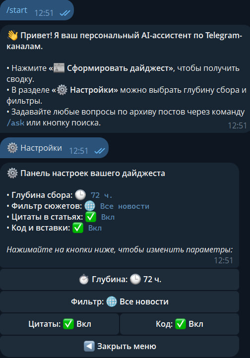
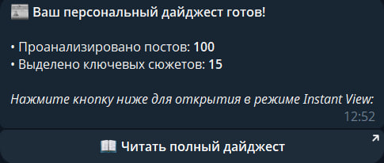
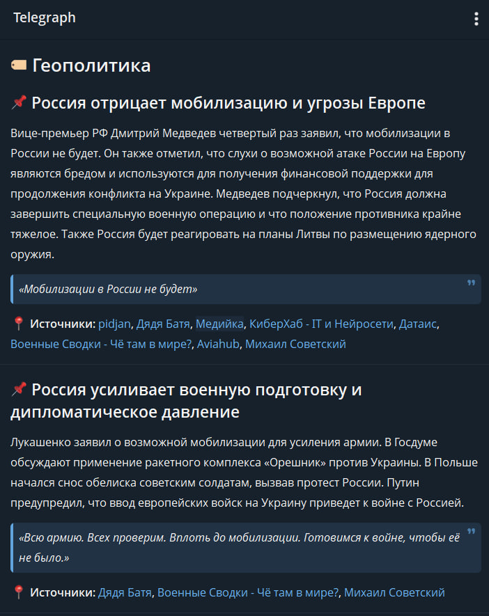

# 📰 TGKSum — AI-ассистент и суммаризатор новостных Telegram-каналов

**TGKSum** — это интеллектуальная модульная система для автоматического сбора, дедупликации, кластеризации и анализа новостных потоков из Telegram-каналов с поддержкой генерации верстки в **Telegraph (Instant View)** и интерактивным **RAG-поиском («Поговори с лентой»)** на базе локальных LLM.

---

## ⚡ Ключевые возможности

### 1\. Умная дедупликация и кластеризация событий (Event Clustering)

- **Векторизация текстов**: Посты переводятся в векторные представления легковесной моделью `cointegrated/rubert-tiny2` (размерность 312\) за миллисекунды.  
- **Иерархическая кластеризация**: Агломеративная кластеризация (`AgglomerativeClustering`) с косинусной метрикой и динамическим порогом расстояния.  
- **Временной штраф (Time-Decay Penalty)**: События, разнесенные во времени более чем на заданное окно ($\\Delta t \> 18$ часов), не склеиваются в один сюжет.  
- **Синтез фактов**: Вместо десятков разрозненных репостов одной и той же новости модель `qwen2.5:14b` получает весь кластер целиком и формирует единую сжатую сводку со списком всех первоисточников.

### 2\. Динамические рубрики и публикация в Telegraph (Instant View)

- **Отказ от жестких категорий**: Тематика новости формируется LLM «на лету» в виде динамических тегов (`#ИИ`, `#Макроэкономика`, `#Геймдев` и др.).  
- **Журнальная верстка**: Публикация лонгрида через Telegraph API с мгновенным открытием внутри Telegram через **Instant View**.  
- **Богатый контент**: Автоматическое выделение цитат спикеров (`<blockquote>`), блоков программного кода (`<pre><code>`) и дедуплицированных ссылок на каналы.
<p align="center">
  
  
  
</p>
### 3\. Интерактивный RAG-архив («Поговори с лентой»)

- **Локальная векторная база Qdrant**: Индексация всех входящих постов (текст, канал, ссылка, дата, топик).  
- **Гибридный поиск (Hybrid Search)**: Одновременное ранжирование через плотные векторы (Dense) и разреженные BM25 (Sparse FastEmbed) по методу Reciprocal Rank Fusion (RRF).  
- **Команда `/ask <вопрос>`**: Возможность задавать вопросы по накопленному архиву постов (например: *«Что писали за последние 3 дня про санкции на экспорт чипов?»*). Модель строго цитирует первоисточники с кликабельными ссылками на посты.

### 4\. Индивидуальные настройки пользователя

- **Интерактивная панель `/settings`**: Удобные инлайн-тумблеры прямо в Telegram.  
- **Гибкая глубина**: Выбор периода выборки (12 ч, 24 ч, 3 дня) или количества постов (30, 70).  
- **Фильтры важности**: Переключение между режимами «Все новости» и «Только крупные сюжеты (от 2 источников)».

---

## 🛠 Технологический стек

- **Язык**: Python 3.10+  
- **Telegram API (Сбор данных)**: [Telethon](https://github.com/LonamiWebs/Telethon) (MTProto Client)  
- **Telegram Bot API (Управление)**: [Aiogram 3.x](https://github.com/aiogram/aiogram)  
- **AI / LLM**: [Ollama](https://ollama.com/) (`qwen2.5:14b` для саммаризации и RAG, `qwen2.5:7b` для классификации)  
- **Эмбеддинги**: `sentence-transformers` (`cointegrated/rubert-tiny2`) \+ `fastembed` (BM25)  
- **Векторная БД**: [Qdrant](https://qdrant.tech/) (Embedded локальный режим / Docker)  
- **Кластеризация**: `scikit-learn` (`AgglomerativeClustering`)  
- **База данных**: SQLite (`aiosqlite`)  
- **Публикация**: Telegraph API (HTML DOM Nodes)

---

## 📁 Структура проекта

tgksum/

├── bot\_controller.py       \# Telegram-бот: управление, настройки (/settings), дайджест и RAG (/ask)

├── clusterer.py            \# Векторная кластеризация постов (EventClusterer)

├── dynamic\_summarizer.py   \# Синтез кластеров в единые сюжеты и тегирование через LLM

├── vector\_store.py         \# Векторное хранилище Qdrant, гибридный поиск (Dense \+ BM25)

├── rag\_assistant.py        \# Логика ассистента: поиск в архиве \+ RAG-генерация ответов

├── telegraph\_publisher.py  \# Верстка и публикация лонгридов в Telegraph (Instant View)

├── telethon\_collector.py   \# Фоновый сбор постов и медиа через MTProto

├── database.py             \# Слой данных SQLite (сообщения, каналы, настройки)

├── run\_pipeline.py         \# Консольный запуск полного цикла сбора и обработки

├── index\_store.py          \# Скрипт первоначальной индексации архива в Qdrant

├── config.py               \# Конфигурация, пути и переменные окружения

├── requirements.txt        \# Список зависимостей

└── README.md               \# Документация проекта

---

## 🚀 Быстрый старт

### 1\. Клонирование репозитория и окружение
```bash
git clone https://github.com/miradimo/tgksum.git

cd tgksum

python \-m venv .venv

\# Активация окружения (Windows PowerShell):

.venv\\Scripts\\Activate.ps1

\# Активация окружения (Linux/macOS):

source .venv/bin/activate
```
&nbsp;
```bash
pip install \-r requirements.txt
```
### 2\. Подготовка моделей в Ollama

Убедитесь, что [Ollama](https://ollama.com/) запущена:
```bash
ollama pull qwen2.5:14b
```
### 3\. Настройка конфигурации

Создайте файл `.env` в корне проекта со следующими параметрами:
```
BOT\_TOKEN=your\_telegram\_bot\_token

API\_ID=your\_telethon\_api\_id

API\_HASH=your\_telethon\_api\_hash

ADMIN\_ID=your\_telegram\_user\_id
```

### 4\. Авторизация и сбор каналов

Для первого запуска и создания пользовательской сессии Telethon:
```bash
python run\_pipeline.py \--sync
```

### 5\. Индексация базы в Qdrant (опционально)

Если в вашей базе SQLite уже есть накопленные посты, проиндексируйте их для работы RAG-поиска:
```bash
python index\_store.py
```
### 6\. Запуск бота
```bash
python bot\_controller.py
```
---

## 🤖 Команды и взаимодействие с ботом

- **`📰 Сформировать дайджест`** (или `/digest [12h | 24h | 50]`) — запуск кластеризации и получение ссылки на Telegraph-статью с Instant View.  
- **`⚙️ Настройки`** (или `/settings`) — панель изменения глубины выборки, фильтрации по важности и отображения цитат/кода.  
- **`🔍 Задать вопрос (RAG)`** (или `/ask <вопрос>`) — поиск по архиву каналов с синтезом ответа и прямыми ссылками на первоисточники.  
- **`/run`** — принудительный запуск полного пайплайна сбора и обработки сообщений.

---

## ⚠️ Дисклеймер

Проект разработан в исследовательских и образовательных целях. При сборе данных соблюдайте правила платформы Telegram и лимиты запросов (Rate Limits) Telegram API.

&nbsp;